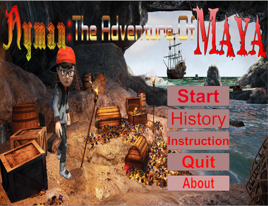
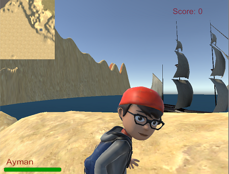
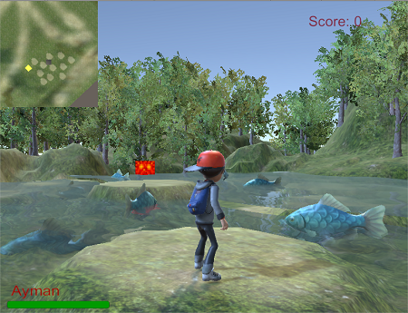
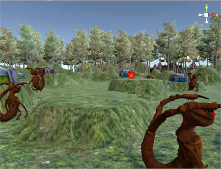
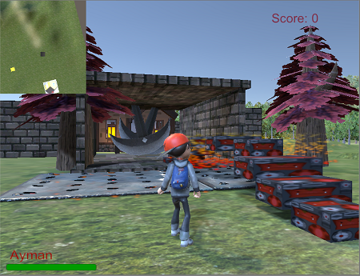
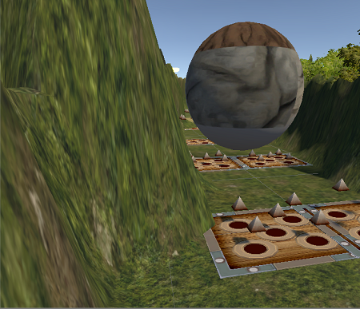
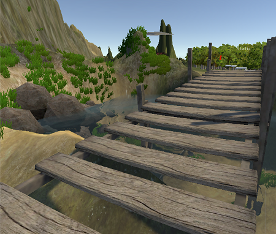
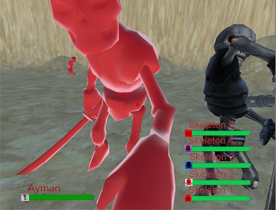

# Ayman: The Adventure Of Maya
<b>Video Link On YouTube</b>

<a href="https://www.youtube.com/watch?v=_GR_VNwa0a8&feature=youtu.be">https://www.youtube.com/watch?v=_GR_VNwa0a8&feature=youtu.be</a>

<b> This file is too big to upload here. Follow this link below to get it. </b>

<a href="https://drive.google.com/drive/folders/0B3q3UOjScg81VkVScmFyclpzSjg">•	https://drive.google.com/drive/folders/0B3q3UOjScg81VkVScmFyclpzSjg</a>

<b>But Before This Let's Have a Look at Some Awesome Snapshot </b>

<body>

    
    
    
    
    
    
    
    

  
</body>
